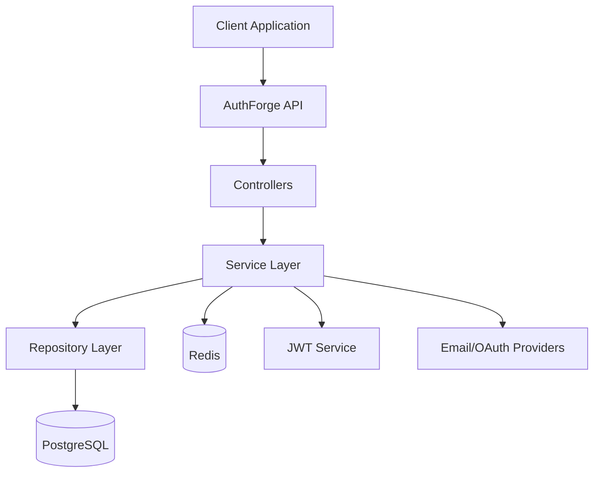

# 🔐 AuthForge

<div align="center">

### Enterprise-Grade Authentication & Authorization Service

A production-ready authentication platform built with **TypeScript**, **Express**, **PostgreSQL**, **Prisma**, and **Redis**. AuthForge centralizes identity management, session handling, authorization, and security best practices into a standalone microservice that can be integrated into any application.


[Documentation](#documentation) •
[Architecture](#architecture) •
[Installation](#installation) •
[API](#api-overview)

</div>

---

# 📖 Overview

AuthForge is a standalone authentication and authorization service designed for modern distributed applications.

Instead of implementing authentication logic inside every project, AuthForge provides a centralized identity platform responsible for:

- User Authentication
- Authorization
- Session Management
- JWT Token Lifecycle
- Refresh Token Rotation
- Password Security
- Role-Based Access Control
- Secure API Access

Its stateless architecture makes it suitable for monoliths, microservices, SaaS platforms, and enterprise applications.

---

# ✨ Features

- 🔐 JWT Authentication
- 🔄 Refresh Token Rotation
- 🚫 Session Revocation
- 🔑 Secure Password Hashing (bcrypt)
- 👥 Role-Based Authorization (RBAC)
- 📦 Modular Service-Repository Architecture
- ⚡ Redis Session Management
- 🛡 Zod Request Validation
- 📄 Structured Logging with Pino
- 🐳 Docker & Docker Compose Support
- 🧪 Production-Ready Code Structure
- 📈 Scalable Stateless API

---

# 🏗 Engineering Highlights

## Security First

- JWT Access & Refresh Tokens
- Refresh Token Rotation
- bcrypt Password Hashing
- Secure HTTP-only Cookies
- Redis Token Blacklisting
- Zod Input Validation

---

## Scalability

- Stateless REST API
- Redis-backed Session Store
- Horizontal Scaling Ready
- Layered Architecture
- Independent Authentication Service

---

## Maintainability

- Service Layer
- Repository Pattern
- Strict TypeScript
- Prisma ORM
- Modular Folder Structure
- Easy Testing

---

# 🛠 Tech Stack

| Category | Technology |
|-----------|------------|
| Language | TypeScript (Strict Mode) |
| Runtime | Node.js v20+ |
| Framework | Express.js |
| Database | PostgreSQL |
| ORM | Prisma |
| Cache | Redis |
| Validation | Zod |
| Authentication | JWT |
| Password Hashing | bcrypt |
| Logging | Pino |
| Containerization | Docker |
| Package Manager | npm |

---

# 🏛 Architecture



---

# 📂 Project Structure

```
src/
│
├── controllers/
├── services/
├── repositories/
├── routes/
├── middleware/
├── validators/
├── config/
├── utils/
├── prisma/
├── types/
└── app.ts
```

---

# 🔐 Security Principles

## JWT Authentication

Short-lived Access Tokens are used for API authorization.

---

## Refresh Token Rotation

Every refresh request:

- Invalidates the previous refresh token
- Issues a new refresh token
- Prevents replay attacks

---

## Password Protection

Passwords are secured using:

- bcrypt
- Salted Hashing
- Configurable Cost Factor

---

## Session Revocation

Redis stores revoked sessions and invalidated refresh tokens, enabling:

- Instant Logout
- Session Expiration
- Multi-device Session Control

---

## Input Validation

Every request is validated using Zod schemas before reaching the business logic layer.

---

# 🚀 Installation

## Prerequisites

- Node.js v20+
- Docker
- Docker Compose
- PostgreSQL
- Redis

---

## Clone Repository

```bash
git clone https://github.com/ali0786mehdi/authforge.git

cd authforge
```

---

## Install Dependencies

```bash
npm install
```

---

## Configure Environment

Create a `.env` file.

Example:

```env
DATABASE_URL=

REDIS_URL=

JWT_SECRET=

JWT_REFRESH_SECRET=

PORT=5000
```

---

## Start Infrastructure

```bash
docker-compose up -d
```

---

## Run Database Migrations

```bash
npx prisma migrate dev
```

---

## Generate Prisma Client

```bash
npx prisma generate
```

---

## Start Development Server

```bash
npm run dev
```

---

# 📌 API Overview

| Method | Endpoint | Description |
|----------|-------------------------|----------------------------|
| POST | /auth/register | Register User |
| POST | /auth/login | Login |
| POST | /auth/logout | Logout |
| POST | /auth/refresh | Refresh Access Token |
| GET | /auth/profile | Get Current User |
| PATCH | /auth/profile | Update Profile |
| PATCH | /auth/password | Change Password |
| DELETE | /auth/account | Delete Account |
| POST | /auth/verify-email | Verify Email Token |
| POST | /auth/resend-verification | Resend Verification Email |
| POST | /auth/forgot-password | Request Password Reset |
| POST | /auth/reset-password | Reset Password with Token |
| POST | /auth/mfa/setup | Initiate MFA Setup |
| POST | /auth/mfa/verify-setup | Verify MFA Setup Code |
| POST | /auth/mfa/login | MFA Login (TOTP) |
| GET | /auth/oauth/google | Initiate Google OAuth |
| GET | /auth/oauth/github | Initiate GitHub OAuth |
| POST | /orgs | Create Organization |
| GET | /orgs | List User Organizations |
| GET | /orgs/:id/members | Get Organization Members |
| POST | /orgs/:id/members | Add Organization Member |

---

# ⚙ Environment Variables

| Variable | Description |
|-----------|------------|
| DATABASE_URL | PostgreSQL Connection |
| REDIS_URL | Redis Connection |
| JWT_SECRET | Access Token Secret |
| JWT_REFRESH_SECRET | Refresh Token Secret |
| PORT | Server Port |

---

# 📊 Design Goals

- High Security
- High Availability
- Scalability
- Clean Architecture
- Maintainability
- Separation of Concerns
- Production Readiness

---

# 🚧 Roadmap

- [x] OAuth (Google)
- [x] GitHub OAuth
- [x] Email Verification
- [x] Password Reset
- [x] Multi-Factor Authentication
- [x] Rate Limiting
- [ ] Audit Logs
- [ ] API Documentation (Swagger)
- [ ] WebAuthn / Passkeys
- [ ] Kubernetes Deployment

---

# 🤝 Contributing

Contributions are welcome!

1. Fork the repository
2. Create your feature branch

```bash
git checkout -b feature/my-feature
```

3. Commit your changes

```bash
git commit -m "Add new feature"
```

4. Push to your branch

```bash
git push origin feature/my-feature
```

5. Open a Pull Request

---

# 📜 License

This project is licensed under the **MIT License**.

---

<div align="center">

### ⭐ If you find this project useful, consider giving it a star!

Made with ❤️ using TypeScript, Express, PostgreSQL, Prisma & Redis

</div>
